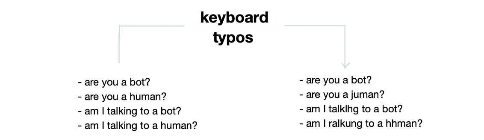
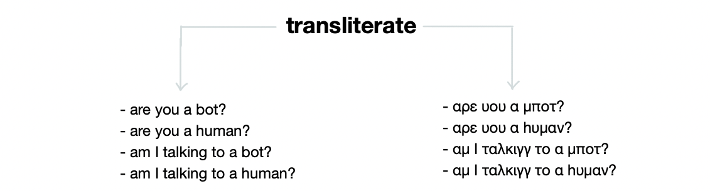
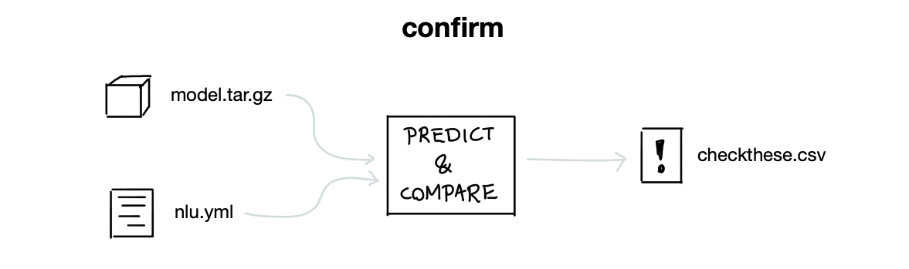

 

# taipo

> taipo is a mispelling of typo, it means [evil spirit](https://en.wiktionary.org/wiki/taipo)

This app contains tools for data quality in Rasa. It can generate
augmented data but it can also check for bad labels in your training data.
The hope is that this tool contributes to data quality that leads to more robust models.

Feedback on Non-English languages is *especially* appreciated!

## Install

You can install this experiment via pip.

```
python -m pip install "taipo @ git+https://github.com/RasaHQ/taipo.git"
```

## Documentation

You can learn all about the project in detail on the [project documentation](https://rasahq.github.io/taipo/).

## Usage

Taipo comes with a small suite of sub-commands.

```
> python -m taipo

  This app contains tools for data quality in Rasa. It can generate
  augmented data but it can also check for bad labels. The hope is this tool
  contributes to data that leads to more robust models.

Options:
  --help  Show this message and exit.

Commands:
  confirm   Confirms labels via a trained model.
  keyboard  Commands to simulate keyboard typos.
  translit  Commands to generate transliterations.
  util      Some utility commands.
```

Check the [quick-start guide](https://rasahq.github.io/taipo/getting-started/) for a tutorial on how to use this tool with Rasa.

## Features

### `taipo keyboard`



Check the [API docs](https://rasahq.github.io/taipo/api/keyboard/) for more info.

### `taipo translit`



Check the [API docs](https://rasahq.github.io/taipo/api/translit/) for more info.

### `taipo confirm`



Check the [API docs](https://rasahq.github.io/taipo/api/confirm/) for more info.
