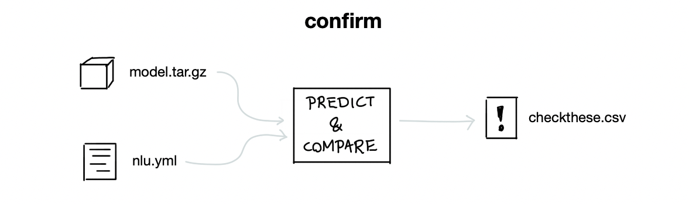

# taipo

This app contains tools for data quality in Rasa. It can generate
augmented data but it can also check for bad labels in your training data.
The hope is this tool contributes to data that leads to more robust models.

Feedback on Non-English languages is *especially* appreciated!

## Installation

You can install this experiment via pip.

```
python -m pip install "taipo @ git+https://github.com/RasaHQ/taipo.git"
```

## Usage

Taipo comes with a small suite of sub-commands.

```
> python -m taipo

  This app contains tools for data quality in Rasa. It can generate
  augmented data but it can also check for bad labels. The hope is this tool
  contributes to data that leads to more robust models.

Options:
  --help  Show this message and exit.

Commands:
  confirm   Confirms labels via a trained model.
  keyboard  Commands to simulate keyboard typos.
  translit  Commands to generate transliterations.
  util      Some utility commands.
```

Check the quick-start guide for a tutorial on how to use this tool.

## Main Features

### Keyboard Typos


Check the [API docs](api/keyboard.md) for more info.

### Transliteration


Check the [API docs](api/translit.md) for more info.

### Confirmation



Check the [API docs](api/confirm.md) for more info.

## What's in the name?

> taipo is a mispelling of typo, it means [evil spirit](https://en.wiktionary.org/wiki/taipo)
